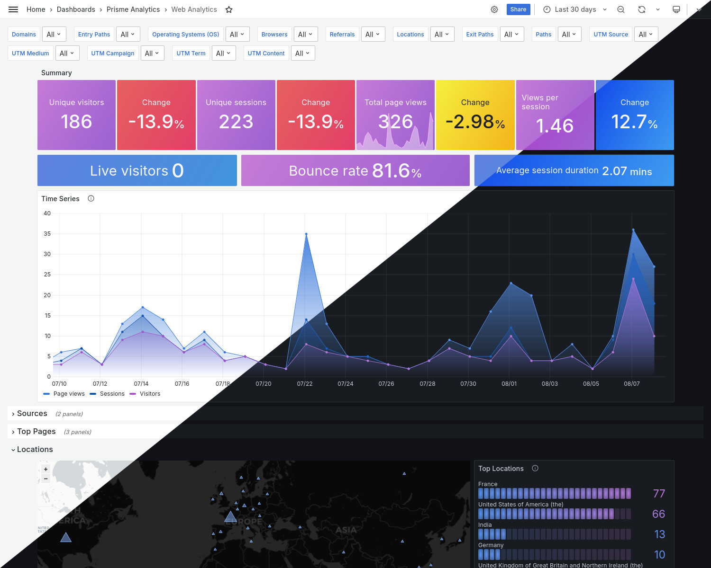

<h3 align="center" class="heading-element" dir="auto">Prisme Labs</h3>
<a aria-label="Permalink: Prisme Labs" href="https://www.prismeanalytics.com/">
    <svg class="octicon octicon-link" viewBox="0 0 16 16" version="1.1" width="16" height="16" aria-hidden="true">
        <path d="m7.775 3.275 1.25-1.25a3.5 3.5 0 1 1 4.95 4.95l-2.5 2.5a3.5 3.5 0 0 1-4.95 0 .751.751 0 0 1 .018-1.042.751.751 0 0 1 1.042-.018 1.998 1.998 0 0 0 2.83 0l2.5-2.5a2.002 2.002 0 0 0-2.83-2.83l-1.25 1.25a.751.751 0 0 1-1.042-.018.751.751 0 0 1-.018-1.042Zm-4.69 9.64a1.998 1.998 0 0 0 2.83 0l1.25-1.25a.751.751 0 0 1 1.042.018.751.751 0 0 1 .018 1.042l-1.25 1.25a3.5 3.5 0 1 1-4.95-4.95l2.5-2.5a3.5 3.5 0 0 1 4.95 0 .751.751 0 0 1-.018 1.042.751.751 0 0 1-1.042.018 1.998 1.998 0 0 0-2.83 0l-2.5 2.5a1.998 1.998 0 0 0 0 2.83Z">
        </path>
    </svg>
</a>

  

    The Open Source, privacy-focused and progressive analytics service.
     
    <a href="https://www.prismeanalytics.com"><strong>Learn more »</strong></a>
     
     
    <a href="https://www.prismeanalytics.com">Website</a>
    ·
    <a href="https://github.com/prismelabs/analytics/issues">Feedback</a>
    ·
    <a href="https://www.prismeanalytics.com/docs" rel="nofollow">Documentation</a>
  

